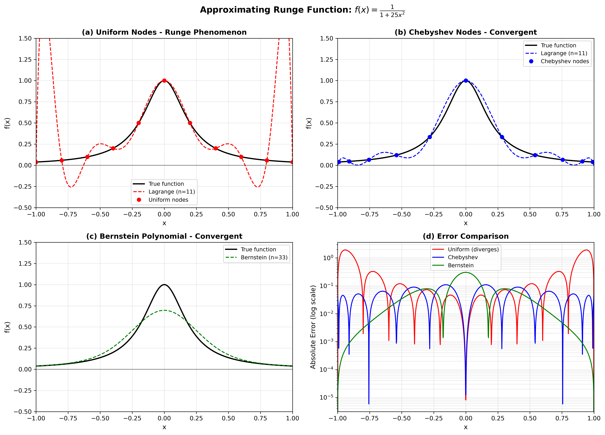

# Figure for Universal Approximation HTML

The figure `runge_phenomenon.png` has been generated and should be included in Section 2.3 (Polynomial Approximation - Not Interpolation) or Section 2.6 (Remark on the Runge Phenomenon) of the universal_approximation.html file.

## Figure Caption:
**Figure 1: Comparison of Approximation Methods for the Runge Function**

The figure shows four panels:
- (a) Lagrange interpolation on uniform nodes exhibits the Runge phenomenon with oscillations at boundaries
- (b) Lagrange interpolation on Chebyshev nodes achieves stable convergence
- (c) Bernstein polynomials provide uniform convergence without oscillations
- (d) Error comparison showing divergence of uniform interpolation vs convergence of Chebyshev and Bernstein methods

## HTML Code to Insert:

```html
<div style="text-align: center; margin: 30px 0;">
    
    <p style="margin-top: 10px; font-style: italic; color: #666;"><strong>Figure 1:</strong> Comparison of approximation methods for the Runge function \(f(x) = \frac{1}{1 + 25x^2}\). (a) Lagrange interpolation on uniform nodes exhibits oscillations (Runge phenomenon), (b) Chebyshev nodes avoid this issue, (c) Bernstein polynomials converge uniformly, (d) Error comparison demonstrates the divergence of uniform interpolation.</p>
</div>
```

This should be inserted after the theoretical discussion of the Runge phenomenon to provide visual illustration of the concepts.
